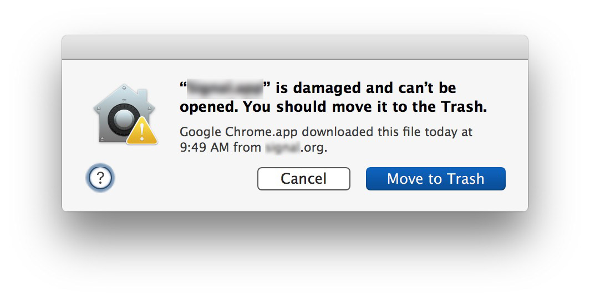

* https://github.com/electron/electron-osx-sign

* launch `Terminal`
```
xattr -cr /Applications/IMHICIHU-Biblioteca.app
```
---------
* check this issue on [code-signing](https://github.com/electron/electron/issues/20027)
* [Codesigning Electron Applications](http://jbavari.github.io/blog/2015/08/14/codesigning-electron-applications/)
* If have issues in the codesign step when running `yarn run package`, you can temporarily disable code signing locally by setting export `CSC_IDENTITY_AUTO_DISCOVERY=false` for the current terminal session.
---------
* Use an internet browser to go to the Releases section at https://github.com/imhicihu/IMHICIHU-Biblioteca/mac
* If you're using a Mac OSX, click on IMHICIHU-Biblioteca.app.zip to download it to your `Downloads` folder.
* Unzip the file by double-clicking on the zip file.
* In Finder, navigate into the `IMHICIHU-Biblioteca-darwin-x64` folder.
* Click Finder menu `File`, `New Finder` window.
* In that new window, click menu `Go`, then `Applications`.
* Drag Git-it and drop it into the Applications files.
* Hold down the `control` key on your keyboard and click `IMHICIHU-Biblioteca.app` for the context menu:
* `IMHICIHU-Biblioteca.app` open
* Click `Open`.
* Click `Open` to confirm the warning:
* The `IMHICIHU-Biblioteca.app` welcome screen should appear

---------
* Note that `IMHICIHU-Biblioteca.app` is an "unsigned application", so later versions of macOS will ask for extra confirmation the first time you run it.
* Note: Neither the macOS or Windows builds are signed, so expect warnings saying they are from an "untrusted developer".
---------
* Right click on the extracted LocalizationEditor.app and choose Open (just a double-clicking will show a warning because the app is only signed with a development certificate)
---------
* [Open a Mac app from an unidentified developer](https://support.apple.com/guide/mac-help/open-a-mac-app-from-an-unidentified-developer-mh40616/mac)

---------
* The Catalina macOS download is notarized and uses the "hardened runtime," which may reduce compatibility with certain modules. You may still run the regular 64-bit macOS download on Catalina; however, you must right click and choose `Open` when running that version for the first time.

---------
* [Notarizing Your App](https://samuelmeuli.com/blog/2019-12-28-notarizing-your-electron-app/)
* [Get your software notarized](https://developer.apple.com/developer-id/)

---------
* `IMHICIHU-Biblioteca.app` can't be opened opened  because it was not downloaded from the App Store.
Your security preferences allow installation of only apps from the App Store.
Click `Ok` then click the System Preferences button
From the System Preferences click Security & Privacy button
You will have message like this
`IMHICIHU-Biblioteca.app` was blocked from opening because it is not from an identified developer.
Click `Open Anyway`
When `IMHICIHU-Biblioteca.app` is not from the App Store. Are you sure you want to open it? is shown
Click `Open`
---------

* https://github.com/hello-efficiency-inc/raven-reader/blob/master/notarize.js

---------
* https://www.npmjs.com/package/electron-installer-codesign

---------
* [Notarizing macOS Software Before Distribution](https://developer.apple.com/documentation/xcode/notarizing_macos_software_before_distribution)

---------
* _Manual_:
Download, open, and drag the app to the Applications folder.
Since `BiblioSearcher` is not signed; go to `Preferences` > `Security & Privacy` > `General` > allow `BiblioSearcher`.
---------
* _Note_: 
Our package is unsigned and will remain like that for the foreseeable future.
When opening it up for the first time you will be prompted that the developer cannot be verified.
Hit cancel, go to `Security` and `Privacy` where there should be a section explaining that "BiblioSearcher" was blocked and an `Open Anyway` button next to it. Click that.
---------
* _Note for Mac macOS Mojave users_: if you see `App can't be opened because Apple cannot check it for malicious software` when opening `BiblioSearcher` the first time, you can right-click the application and choose `Open`. This should only be required the first time opening on Mojave.
---------
* Please note that Apple's prudent security measures mean that you must, when first opening the app, authorise it to open in the security section of System Preferences by clicking 'Open Anyway'.
